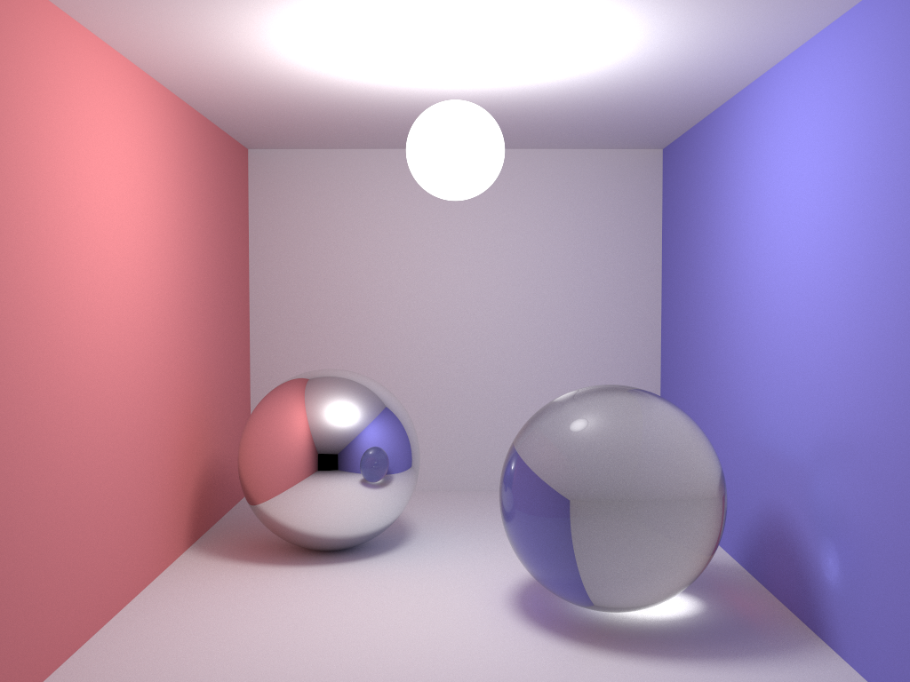

# SmallptGPU-Py

SmallptGPU-Py 是一个基于 Python 和 OpenCL 的光线追踪渲染器，支持 GPU 加速。该项目实现了一个简单的路径追踪算法，能够渲染复杂的场景，并支持多设备负载均衡。



# 待办事项
- [ ] 完善文档
- [ ] 添加更多示例场景
- [ ] 优化性能
- [ ] 复刻原版 smallpt-gpu V2.0 的所有功能

## 功能特性

- **路径追踪**：基于物理的光线追踪算法，支持漫反射、镜面反射和折射。
- **GPU 加速**：利用 OpenCL 实现高性能计算，支持多 GPU 渲染。
- **多设备负载均衡**：根据设备性能动态分配工作负载。
- **实时交互**：支持通过键盘和鼠标调整相机视角和场景物体位置。
- **场景文件支持**：通过简单的 `.scn` 文件定义场景。
- **依赖管理**：使用 `uv` 工具自动安装和管理依赖项。
- **跨平台支持**：支持 Windows、Linux 和 MacOS 平台，使用 `uv` 工具进行安装和运行。

## 依赖

运行该项目需要以下依赖：

- Python >= 3.11
- [NumPy](https://numpy.org/) >= 2.2.4
- [Pillow](https://python-pillow.org/) >= 11.1.0
- [PyOpenCL](https://documen.tician.de/pyopencl/) >= 2025.1
- [PyOpenGL](https://pyopengl.sourceforge.io/) >= 3.1.9
- [PyOpenGL-accelerate](https://pypi.org/project/PyOpenGL-accelerate/) >= 3.1.9
- [siphash24](https://pypi.org/project/siphash24/) >= 1.7

## 安装

1. 克隆项目到本地：

   ```bash
   git clone https://github.com/your-username/smallpt-gpu-py.git
   cd smallpt-gpu-py
   ```

2. 安装uv：
    1. Windows平台
    ```bash
    winget install --id=astral-sh.uv -e
    ```

    2. Linux平台
    ```bash
    curl -LsSf https://astral.sh/uv/install.sh | sh
    ```

    3. MacOS平台
    ```bash
    curl -LsSf https://astral.sh/uv/install.sh | sh
    ```

## 使用方法

### 运行程序

#### 第一次运行

由于使用了`uv`工具，所以你可以直接运行起来，`uv`会自动安装依赖项。

第一次运行的话直接运行以下命令：

```bash
uv run smallptGPU.py
```
你就能看到一个窗口弹出来，显示渲染的图像。

不提供参数运行，将使用默认配置：

- 启用 CPU 和 GPU 渲染。
- 图像分辨率为 1024x768。
- 场景文件为 cornell.scn。

#### 高级运行参数

程序运行参数详细解释：

```bash
uv run smallptGPU.py [use_cpus] [use_gpus] [force_gpu_work_size] [width] [height] [scene_file]
```

- `use_cpus`：是否启用 CPU 渲染（1 表示启用，0 表示禁用）。
- `use_gpus`：是否启用 GPU 渲染（1 表示启用，0 表示禁用）。
- `force_gpu_work_size`：强制 GPU 工作组大小（0 表示自动选择）。
- `width` 和 `height`：渲染图像的宽度和高度。
- `scene_file`：场景文件路径。

例如：

```bash
uv run smallptGPU.py 0 1 0 1024 768 scenes/cornell.scn
```


### 键盘交互

运行时可以通过以下键盘操作与程序交互：

#### 相机控制

- `w` / `s`：向前 / 向后移动相机。
- `a` / `d`：向左 / 向右移动相机。
- `r` / `f`：向上 / 向下移动相机。
- 方向键：旋转相机视角。

#### 场景物体控制

**注意：请使用小键盘进行控制**

- `+` / `-`：选择下一个 / 上一个球体。
- `4` / `6`：向左 / 向右移动选中的球体。
- `8` / `2`：向前 / 向后移动选中的球体。
- `9` / `3`：向上 / 向下移动选中的球体。

#### 其他功能

- `p`：保存当前渲染图像为 `image.png`。
- `h`：显示 / 隐藏帮助信息。
- `k`：显示 / 隐藏工作负载可视化。
- `l`：重置负载均衡。
- `n` / `m`：选择上一个 / 下一个 OpenCL 设备。
- `v` / `b`：减少 / 增加当前设备的性能索引。

## 场景文件格式

场景文件使用 `.scn` 格式，支持以下指令：

- `camera x y z tx ty tz`：定义相机位置 `(x, y, z)` 和目标点 `(tx, ty, tz)`。
- `size n`：定义场景中球体的数量。
- `sphere r x y z e_r e_g e_b c_r c_g c_b refl`：定义球体的属性：
  - `r`：半径。
  - `(x, y, z)`：位置。
  - `(e_r, e_g, e_b)`：发射光颜色。
  - `(c_r, c_g, c_b)`：表面颜色。
  - `refl`：反射类型（0-漫反射，1-镜面反射，2-折射）。

示例场景文件 simple.scn：

```
camera 20 80 300  0 15 0
size 5
sphere 1000  0 -1000 0  0 0 0     0.75 0.75 0.75  0
sphere 10    35 10 0    0 0 0     0.75 0 0        0
sphere 15    -35 15 0   0 0 0     0 0.75 0        0
sphere 20    0 20 -35   0 0 0     0 0 0.75        0
sphere 8     0 60 0     15 15 15  0 0 0           0
```

## 项目结构

### 代码结构
该项目的代码结构如下：

```
smallpt-gpu-py/
├── camera.py           # 定义相机类
├── displayfunc.py      # 显示和交互逻辑实现
├── geom.py             # 定义几何体
├── renderconfig.py     # 渲染配置类
├── renderdevice.py     # 渲染设备类
├── rendering_kernel.cl # OpenCL 渲染内核
├── scenes/             # 场景文件目录
├── smallptGPU.py       # 主程序入口
└── vec.py              # 定义向量操作
```

#### uv相关文件
该项目的 `uv` 相关文件结构如下：

```
.python-version
pyproject.toml
uv.lock
```

## 示例

运行以下命令渲染 `cornell.scn` 场景：

```bash
uv run smallptGPU.py 1 1 0 1024 768 scenes/cornell.scn
```

渲染完成后，按 `p` 保存图像为 `image.png`。

## 贡献

欢迎提交 Issue 和 Pull Request 来改进该项目。

## 许可证

该项目基于 MIT 许可证开源，详情请参阅 LICENSE 文件。